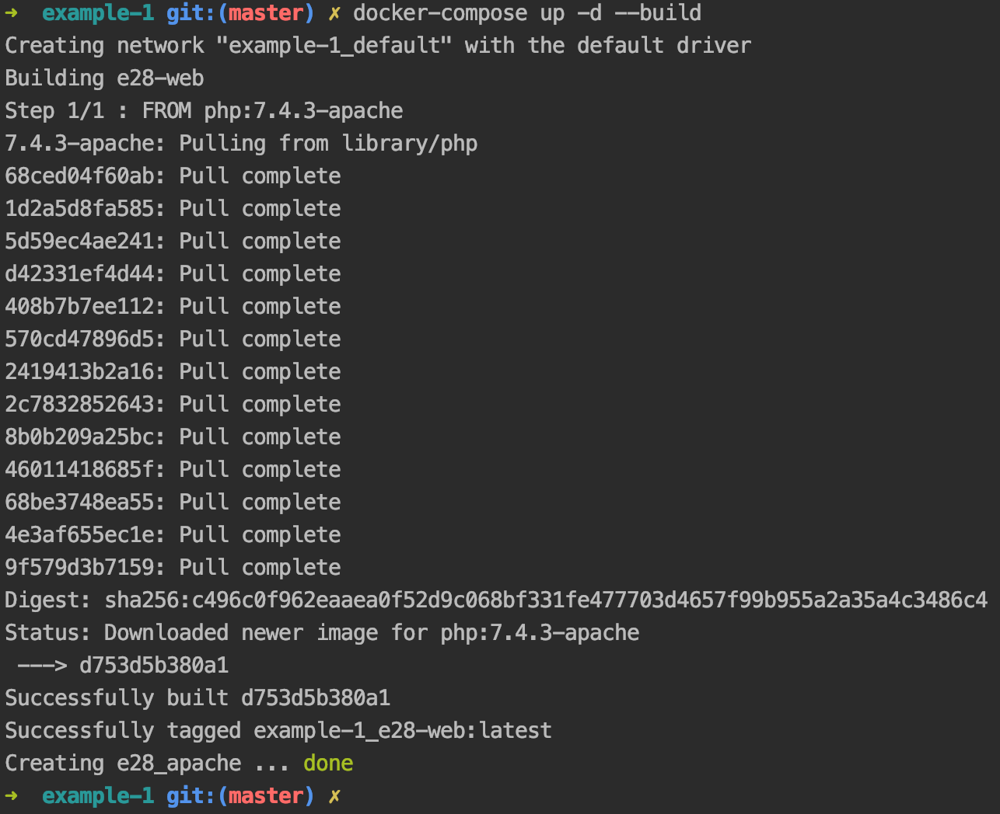
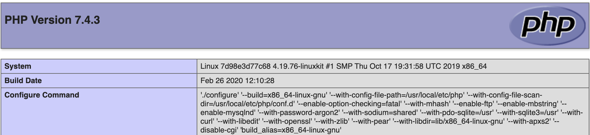
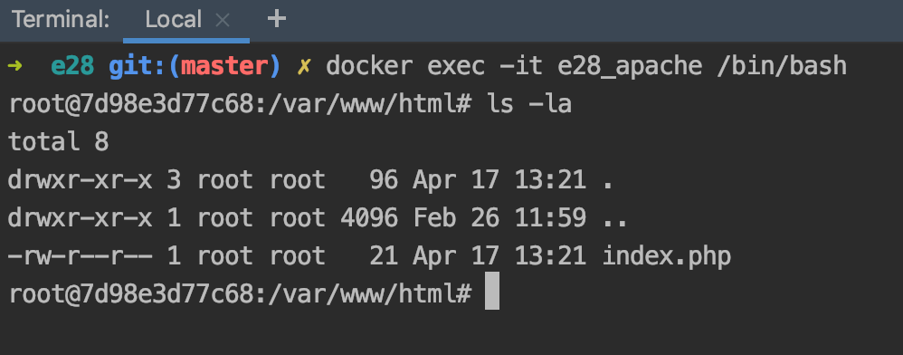
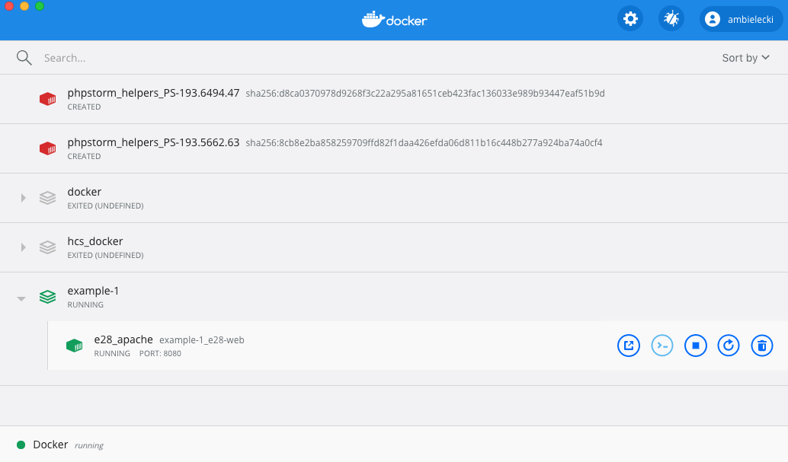
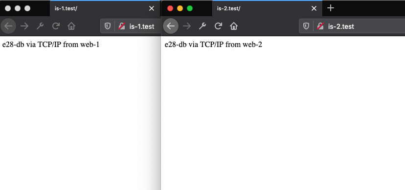

# Docker and Docker-Compose for Development Environments

## What is Docker? 
The simplest (technical) answer is that Docker is an engine for creating and running containers. 
Docker provides the interface between these containers and your operating system.  A container is a 
way of packaging code and its dependencies (os, drivers, packages, etc) so it can run virtually 
anywhere and in isolation. So, there is a version of the Docker engine for Mac, Windows, or Linux. 
This engine will allow the same containers to run on any system by providing the interface to OS 
APIs.


What does that mean for you the developer?  It means simpler development on near production systems 
on a local environment of your choosing. It does not matter if members of your team work with Windows, 
Linux, or Mac; with a few simple tweaks you can all work with the same dev environment. As a solo 
developer you gain the comfort of knowing your code is running in a near production 
environment in your container (so if you intend to deploy on Ubuntu 18.04, you can develop in a 
container with Ubuntu 18.04). Your containers also provide code isolation, so you can run many 
versions of a tool (for example PHP 7.1 and 7.4 for different projects) without interference. And, 
best of all, no more installing programs on your root OS (my personal example - installing PostgreSQL 
locally and having it ruin everything - leading to a fresh Windows install).

Sources:  
[Docker - Get Started](https://docs.docker.com/get-started/)  
[InfoWorld - What is Docker?](https://www.infoworld.com/article/3204171/what-is-docker-the-spark-for-the-container-revolution.html)

### Images, Containers, Volumes - oh my

There are many new terms to deal with when getting started with Docker, with three of the fundamental 
building blocks being Images, Containers, and Volumes. Every environment you create will most likely 
use all three of these objects, so having a basic understanding of them will be helpful.

#### Images

Quite simply, an image is the blueprint for our docker container. An image is a binary file 
that contains all the code, libraries, etc to run a specific task.  An image can be as simple as an 
OS build such as Ubuntu, to the full code stack of an application.

We will usually deal with images that will contain the the base dev ops components of a deployment,
OS, web server, runtimes for things such as PHP, Node, or Python.  We will also see images for databases such as MySQL 
or Mongo, and services such as Redis caching or simple queue services.  From there we will add the specifics of our 
deployment, libraries we need for our code such as a PDF generator, library managers such as NPM or Composer, or database drivers.

If we choose, a snapshot in time can be taken once our dev environment is set up, with all of these components in place, 
to create a shareable image. 

Sources:    
[Docker - Overview](https://docs.docker.com/engine/docker-overview/)


#### Containers

Containers are built from images, it is the process on your machine that contains the code necessary for running our task. 
We will spend our time interacting with our application in container.

Sources:    
[Docker - What is a Container](https://www.docker.com/resources/what-container)


#### Volumes

In general the data created within a container is incaccessible from the host machine and destroyed along with a 
container, but it is useful for our container to have access to some files from the host and allow both the container and 
host to modify the files.  This is where a volume comes in, we can bind data to our container's filesystem, so it can be 
accessed from both sides.


This is particularly useful for the code you are developing, you can work from your local filesystem and have the changes 
persisted in the container.  Also, the container is free to create or modify files (say generating a pdf), that will be 
persisted to the local machine.

This also allows you to rebuild your container without losing data, say from a database. Your database storage directory 
can be a volume shared with the local filesystem and will persist, even if the container is destroyed.  

Sources:    
[Docker - Volumes](https://docs.docker.com/storage/volumes/)

### Why Use Docker over XAMPP?

This will obviously be from personal experience and slightly opinionated, but I have found docker to be a more 
versatile solution to installing software such as XAMPP directly on my system.

#### Safety

First and foremost, docker containers are isolated from the host system and can be created and destroyed at 
will. You reduce the risks of conflicts, data corruption, and general issues with your host system.  From 
personal experience, I have incapacitated my Windows 10 machine attempting to install Postgres, which was needed 
for a development project. If I had done that in docker, I would have just deleted the container and moved on.

#### Closer to Production

Most production environments you will encounter are Linux based (unless you are a C#/.NET programmer), which can 
behave differently than a Windows or Mac environment.  For example, Linux can be more strict on capitalization of 
file / class names (a problem I ran into developing on XAMPP and deploying to Ubuntu). There are docker images 
available to mimic every flavor of Linux distro, database version, etc.

#### Ease of Running Multiple Versions

It is trivial to run multiple containers with different versions of software concurrently, say different versions 
of PHP, or Node, simplifying testing. One could also configure code for a new webserver such as nginx, all without 
destroying your current setup.

#### Ease of Onboarding Additional Team Members

Docker configurations are stored in Dockerfiles and ochestrated via docker-compose.yml files. These (or examples) can 
be included in version control, allowing for quick onboarding of new team members and the assurance that everyone 
has a similar dev environment. As docker will run on both Mac and Windows, developers can choose the system where they 
are comfortable, but still be assured their containers are the same. 

## Installation

### System Requirements

System requirements and installers can be found at the links below for both Windows and Mac.  
<https://docs.docker.com/docker-for-windows/install/>   
<https://docs.docker.com/docker-for-mac/install/>   

All modern Mac hardware (since 2010), running macOS 10.13 or greater is capable of running Docker.

Only Windows 10 Pro systems (with Hyper-V support) are capable of running the most up to date version of Docker. 
There is an older version ([Docker Toolbox](https://docs.docker.com/toolbox/), which can run on older versions and 
Home versions of Windows, but is now considered legacy software and receives minimal support.

### Simple Test
<https://docs.docker.com/get-started/>

First we want to test that our installation of docker desktop was successful.  Open a terminal 
window and type the following `docker run hello-world`.  You should see something similar to the 
following:


The text is mostly self-explanatory, Docker performed the following tasks:
* Checked to see if we had a local copy of the hello-world image (we did not)
* Pulled a copy from Docker Hub
* Created a container with that image
* That image is programmed to output the text you see

Great, we know our setup is working correctly. There are many more things we could do with just 
Docker and the command line, but we will skip directly to a much more user-friendly (and commonly 
used in the workplace) tool: docker-compose.

## Docker-Compose   
<https://docs.docker.com/compose/compose-file/>

At it's simplest, we will want two files to get started, a docker-compose.yml file to specify our overall 
project structure and a Dockerfile with build instructions specific to our container (it can be done with 
just docker-compose.yml for simple situations where no modifications to the image are necessary).

### Simple Example

In the examples/example-1 directory you can find a very basic docker-compose.yml and Dockerfile, along with a 
small index.php file. We will create a simple apache server to start.

In the Dockerfile we will specify our image to download as the base of our container.  Conveniently, the 
official PHP docker builds contain a version with apache on a lightweight Linux distro, Alpine.

```
FROM php:7.4.4-apache
```

That's it, we are specifying the php project from Dockerhub, with a tag of 7.4.4-apache as a specifc build.

Next we must create our docker-compose.yml file, 

```yaml
version: '3'

services:
  e28-web:
    container_name: 'e28_apache'
    build: ./build
    ports:
      - "8080:80"
    volumes:
      - ./volume/html:/var/www/html
```

To start, we are using v3 of the docker-compose specification and specify that at the top.  The services 
section will contain information about each container we will be building (in this case one, our web server). 
We give the container a name (helpful in other commands).  

build provides the location of our Dockerfile with 
instructions for getting our image (just the directory name here, Dockerfile is assumed).  

Next, we are specifying how 
our system will access ports on the containers network.  We are mirroring port 80 of the container (standard HTTP port) 
to port 8080 on the localhost, so going to http://localhost:8080 will get content from port 80 in the container. We can 
link multiple ports (add another line), if we had other services or wanted to use 

Finally, we will link a volume to our container, in this case we are placing the directory containing our sample 
index.php file in the default apache server location `/var/www/html`

In this index.php we simply have 

```php
<?php
    phpinfo();
````

Which will display information about our PHP install and is a good test that our server is up and running.

Sources:    
[Docker Compose](https://docs.docker.com/compose/)

### Start it Up

Next we will build and start our container. Open a terminal and navigate to the directory with our 
docker-compose.yml file and run the command: `docker-compose up -d --build`

The up command will build and start all containers specificed in our yml file.  -d specifies that this action 
happens in the background (so when finished we will get our terminal back), and --build will rebuild any containers 
that have changed since the last build (not entirely necessary for build one).

You should see output similar to this (this was php:7.4.3-apache):



Docker has pulled the image (and its intermediary images) and built our container.

If we navigate to http://localhost:8080 we should now see our phpinfo page:



Yay, we have a web server!

## Important Commands and Opening a Terminal

### Opening a terminal

Great, we have a server, but we need to be able to interact with it. One way to do that is 
by using the command `docker exec` which will run a command in our container.

From your terminal type:
 ```
docker exec -it e28_apache /bin/bash
```

We pass the flags i and t for interactive (allows us to interact with the results of the command) TTY,
which allows a connection to the container.  We then pass the container name and command to run, in this 
case the bash shell.



Here I've run a simple ls command in the container itself, showing the linked index.php from our volume.

Another way to open a terminal is through Docker Desktop's Dashboard.

On a Mac on can find the docker icon (a whale) on the top toolbar and right click, select Dashboard from 
the menu. On windows, find the same icon in the system tray, right click, and again, select Dashboard.



You should see a list of the Docker networks you have (in this case my example-1 network is running). And can 
expand to see individual containers. You can click on the terminal icon (looks like `>_`), to open a terminal 
in your container. 

You can also find other helpful shortcuts here, you can start and stop containers, delete them, 
or get more detailed information about them.

Sources:    
<https://docs.docker.com/engine/reference/commandline/exec/>    
<https://docs.docker.com/docker-for-mac/dashboard/> 

### Basic Docker-Compose Commands

There are a number of important commands to be aware of when using docker-compose (all run in the directory with yml file)
* `docker-compose start`: this will start all existing containers (that have already 
been built)
* `docker-compose stop`: stop all running containers
* `docker-compose up`: builds new containers and starts them
* `docker-compose down`: stops and removes containers

See the link in sources for more useful commands and options

Sources:    
<https://docs.docker.com/compose/reference/>

### Cleanup - images etc

One downside of docker is that it can create a lot of files and take up a decent amount of storage space. Images can have 
intermediary build steps that are saved, old containers can be left dangling, etc, and this can add up. More information 
on how to remove old networks, images, and containers can be found at the link below.

Sources:    
<https://docs.docker.com/config/pruning/>

## Adding Other Services (MySQL)

Very often we will need multiple containers to interact with multiple services, such as a database. In example-2 we will 
add in the link to a mysql-8 database.

Our docker-compose.yml will now look like:
```yaml
version: '3'

services:
  e28-web:
    container_name: 'e28_apache_2'
    build: ./builds/web
    ports:
      - "8080:80"
    volumes:
      - ./volumes/html:/var/www/html
    links:
      - e28-db

  e28-db:
    container_name: 'e28_mysql'
    image: mysql:8.0.14
    command: mysqld --character-set-server=utf8 --collation-server=utf8_unicode_ci --default-authentication-plugin=mysql_native_password
    ports:
      - "33060:3306"
    volumes:
      - ./volumes/db:/var/lib/mysql
    working_dir: /var/lib/mysql
    environment:
      - MYSQL_ROOT_PASSWORD=root
      - MYSQL_DATABASE=e28
```

Our web server has been renamed e28_apache_2 to avoid collisions with our previous container and we have 
added a link to our new service, e28-db.  This shows that the e28-web container relies on e28-db and will need to start 
together.

We've added a new instruction to our Dockerfile for e28-web (which is now in builds/web), 
```dockerfile
RUN docker-php-ext-install \
    pdo \
    pdo_mysql
```
the RUN directive will run the command in our container as a part of the build process and persist the changes in a new 
image, which we will be using.  Here we install the necessary extensions to use connect to mysql with the PHP 
PDO driver.

Our next service is the database container.  Instead of a Dockerfile, we just specify an image to use (in this case I know 
I will not be adding more RUN or similar commands).

Next we specify a command, this will be run when the container starts, and in this instance sets some defaults for the mysql 
service. 

We open a port to the local system at 33060 (the native mysql port is 3306) and set a volume to store db info (you will 
want to keep this directory out of version control).

`working_dir` allows us to set a directory where docker will execute commands, it is useful as an entrypoint when using 
a terminal. So, when opening a terminal in this container we will go directly to `/var/lib/mysql`

Finally, we set `environment` which contains container environment variables, here we are setting the default root 
password and database (which helpfully creates the database when creating the container).

A quick `docker-compose up -d --build` and we are good to go.

Our index.php file contains code to show that we can connect to the database.  Going to localhost:8080 should show: 


__An important note, communication between containers is done via the container name. A normal connection string 
would look more like `$conn = new PDO('mysql:host=localhost;dbname=e28', 'root', 'root');`, in this case we replace localhost 
with the container name, e28-db for `$conn = new PDO('mysql:host=e28-db;dbname=e28', 'root', 'root');`__

Sources:    
<https://www.php.net/manual/en/pdo.connections.php> 
<https://medium.com/@crmcmullen/how-to-run-mysql-8-0-with-native-password-authentication-502de5bac661>

## Orchestrating Many Containers with nginx-proxy

One thing you may have noticed, we have been accessing our web sites via localhost:8080, which is a pain. It is 
much nicer to use local domains instead, but this can be troublesome with Docker.  Only one container at a time 
can be mapped to a local port, so only one could be mapped to 80, allowing a local domain.  Fortunately, someone has 
a docker image that can be used to create an automapping nginx-proxy to orchestrate many containers, each 
responding to its own domain name.

To demonstrate, we will add two new hosts to our local hosts file as described previously, is-1.test and 
is-2.test.  

In the example-3 folder we can see our new docker-compose.yml file, there's quite a bit going on here, so 
let us unpack it all.

```yaml
version: '3'

services:
  nginx-proxy:
    container_name: e28_nginx_proxy
    build: ./builds/nginx-proxy
    ports:
      - "80:80"
    volumes:
      - /var/run/docker.sock:/tmp/docker.sock:ro

  e28-web-1:
    container_name: 'e28_apache_3'
    build: ./builds/web-1
    volumes:
      - ./volumes/web-1/html:/var/www/html
    links:
      - e28-db
    environment:
      - VIRTUAL_HOST=is-1.test

  e28-web-2:
    container_name: 'e28_apache_4'
    build: ./builds/web-2
    volumes:
      - ./volumes/web-2/html:/var/www/html
    links:
      - e28-db
    environment:
      - VIRTUAL_HOST=is-2.test

  e28-db:
    container_name: 'e28_mysql_2'
    image: mysql:8.0.14
    command: mysqld --character-set-server=utf8 --collation-server=utf8_unicode_ci --default-authentication-plugin=mysql_native_password
    ports:
      - "33060:3306"
    volumes:
      - ./volumes/db:/var/lib/mysql
    working_dir: /var/lib/mysql
    environment:
      - MYSQL_ROOT_PASSWORD=root
      - MYSQL_DATABASE=e28
```

We start by adding a new service, nginx-proxy, which will handle all of our incoming requests (it is mirroring port 80 
to local 80, so domains we register with the host system will be directed to nginx-proxy). The Dockerfile for this service 
is pulling an ngnix config file that will ensure proper handling of our requests. 

This container will auto-register the other domains on our network as long as they have their domain as an 
environment variable. You can see this in web-1 and web-2 as `VIRTUAL_HOST=is-1.test`;  As a note, a container can 
host multiple sites, the VIRTUAL_HOST block becomes a string with a comma separated list, such as:

```
environment:
      - "VIRTUAL_HOST=e28.test,e28p1.test,e28p2.test,zipfoods.test"
```
We will also add an apache conf file to our web servers for each site it will be serving (in this case a single site), 
and we will copy that file from the Dockerfile:

```dockerfile
FROM php:7.4.4-apache

RUN docker-php-ext-install \
    pdo \
    pdo_mysql

RUN a2enmod rewrite
COPY ./is-1.test.conf /etc/apache2/sites-available/000-default.conf
```

We see the new `COPY` command here, which is a one time copy of a file or directory into our images, changes from the 
container are not reflected in the host system.

`docker-compose up -d --build` and we can now show that our two sites are active.



Sources:    
<https://github.com/nginx-proxy/nginx-proxy>    
<https://blog.ippon.tech/set-up-a-reverse-proxy-nginx-and-docker-gen-bonus-lets-encrypt/>   
<http://jasonwilder.com/blog/2014/03/25/automated-nginx-reverse-proxy-for-docker/>    

## Put it All Together - A Final Example

Normally our project files would not live as subdirectories of our docker project, but we would have a struture like:
```
|-projects
|   |-e28
|   |-e28-api
|   |-docker
```
where the docker folder is a sibling of our e28 repository and an api I am using for the course. This is the setup I 
use for the course and the example docker-compose.yml and associated Dockerfiles can be found in examples/docker. You 
can see that my Dockerfile has grown considerably, it contains the depedencies I need for a number of projects and is one 
I reuse regularly (works great for Laravel for example). It also contains node/npm, so will work well with Vue.

I have actually stored this build on Dockerhub to make it easier to pull into projects. You can read more about that 
process here: <https://docs.docker.com/docker-hub/builds/>, find my repository on github here: 
<https://github.com/ambielecki/php-base-box> and the build on Dockerhub here: 
<https://hub.docker.com/r/ambielecki/php-base-box>. I've used the explicit steps in the example, but one could instead 
pull in the build from dockerhub with `FROM ambielecki/php-base-box:latest` and then running project specific steps ( 
such as installing vue-cli in the e28 Dockerfile and setting the apache confs).

The only caveat I have found is that this setup does not play nice with Hot Module Reloading and the Vue Server (creating 
a pure node container is the next project).  To account for this I build dev dependencies and watch with the following 
commands added to my package.json scripts section (dev and watch)
```json
"scripts": {
    "serve": "vue-cli-service serve",
    "build": "vue-cli-service build",
    "lint": "vue-cli-service lint",
    "dev": "vue-cli-service build --mode development",
    "watch": "vue-cli-service build --mode development --watch"
  }
```