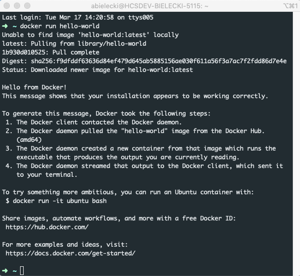

# Docker and Docker-Compose for Development Environments

## What is Docker? 
<https://docs.docker.com/get-started/>

### Containers, Images, Volumes - oh my <
<https://www.infoworld.com/article/3204171/what-is-docker-the-spark-for-the-container-revolution.html>
### Why Use Docker over XAMPP?
### Other Options (VMs)

## Installation

### System Requirements
<https://docs.docker.com/docker-for-windows/install/>
<https://docs.docker.com/docker-for-mac/install/>

### Simple Test
<https://docs.docker.com/get-started/>

First we want to test that our installation of docker desktop was successful.  Open a terminal 
window and type the following `docker run hello-world`.  You should see something similar to the 
following:

The text is pretty self explanatory, Docker performed the following tasks:
* Checked to see if we had a local copy of the hello-world image (we did not)
* Pulled a copy from Docker Hub
* Created a container with that image
* That image is programmed to output the text you see

Great, we know our setup is working correctly. There are many more things we could do with just 
Docker and the command line, but we will skip directly to a much more user-friendly (and commonly 
used in the workplace) tool: docker-compose.

## Docker-Compose
<https://docs.docker.com/compose/compose-file/>
### docker-compose.yml
#### Dockerfile
#### Linking your files (volumes)
<https://docs.docker.com/docker-for-mac/osxfs-caching/>
#### Other Services (MySQL)
<https://medium.com/@crmcmullen/how-to-run-mysql-8-0-with-native-password-authentication-502de5bac661>
#### Opening a terminal
<https://docs.docker.com/engine/reference/commandline/exec/>
<https://docs.docker.com/docker-for-mac/dashboard/>

## Important Commands
### Up, Start, Stop
<https://docs.docker.com/compose/reference/>
### Cleanup - images etc
<https://docs.docker.com/config/pruning/>

## Orchestrating Many Containers
### nginx-proxy 
<https://github.com/nginx-proxy/nginx-proxy>
<https://blog.ippon.tech/set-up-a-reverse-proxy-nginx-and-docker-gen-bonus-lets-encrypt/>
<http://jasonwilder.com/blog/2014/03/25/automated-nginx-reverse-proxy-for-docker/>

## Advanced Topics / Tips
### Other services
#### Mongo
<https://medium.com/faun/managing-mongodb-on-docker-with-docker-compose-26bf8a0bbae3>
#### Node Server 
<https://nodejs.org/de/docs/guides/nodejs-docker-webapp/>
#### Saving to Docker Hub
<https://docs.docker.com/docker-hub/builds/>

## Quickstart - The TLDR
